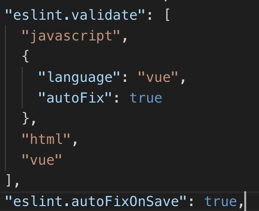

# eslin + husky 保证前端代码规范

## 安装
::: tip 所需包
1. eslint@5.8.0
2. babel-eslint@10.0.1
3. vue-eslint-parser@5.0.0
4. eslint-plugin-vue@5.1.0
:::

## 配置自定义规则
::: tip 步骤1
- 在根目录下创建基础js校验规则文件eslint_base.js和Vue语法eslint规则文件.eslintrc.js
:::
```js
module.exports = {
	root: true, // 以当前目录为根目录，不再向上查找 .eslintrc.js
	// 开启的全局变量
	env: {
		node: true, // Node.js 全局变量和 Node.js 作用域
		es6: true, // 启用除了modules以外的所有ECMAScript6特性（该选项会自动设置ecmaVersion解析器选项为6）
		browser: true // 浏览器环境中的全局变量
	},
	/*
    所有启用的规则及其各自的错误级别
    "off" 或 0 - 关闭规则
    "warn" 或 1 - 开启规则，使用警告级别的错误：warn (不会导致程序退出)
    "error" 或 2 - 开启规则，使用错误级别的错误：error (当被触发的时候，程序会退出)
  */
	rules: {
		/*
      Possible Errors
      这些规则与 JavaScript 代码中可能的错误或逻辑错误有关
    */
		'no-compare-neg-zero': 'error', // 禁止与-0进行比较
		'no-cond-assign': 'error', // 禁止条件表达式中出现赋值操作符
		'no-constant-condition': 'error', // 禁止在条件中使用常量表达式
		'no-debugger': 'error', // @fixable 禁止使用debugger
		'no-empty': 'error', // 禁止出现空语句块
		'no-dupe-args': 'error', // 禁止function定义中出现重名参数
		'no-dupe-keys': 'error', // 禁止对象字面量中出现重复的 key
		'no-inner-declarations': 'error', // 禁止在嵌套的块中出现变量声明或 function 声明
		'use-isnan': 'error', // 要求使用 isNaN() 检查 NaN
		'valid-typeof': 'error', // 强制 typeof 表达式与有效的字符串进行比较

		/*
      Best Practices
      这些规则是关于最佳实践的，帮助你避免一些问题
    */
		'eqeqeq': 'error', // @fixable 要求使用 === 和 !==
		'no-empty-function': [ // 不允许有空函数，除非是将一个空函数设置为某个项的默认值
			'error',
			{
				allow: [
					'functions',
					'arrowFunctions'
				]
			}
		],
		'no-empty-pattern': 'error', // 禁止解构中出现空 {} 或 []
		'no-eval': 'error', // 禁止使用 eval
		'no-floating-decimal': 'error', // 表示小数时，禁止省略 0，比如 .5
		'no-global-assign': 'error', // 禁止对全局变量赋值
		'no-implicit-coercion': [ // 禁止使用 ~ 等难以理解的运算符, 仅允许 !!
			'error',
			{
				allow: [
					'!!'
				]
			}
		],
		'no-implicit-globals': 'error',  // 禁止在全局作用域下定义变量或申明函数
		'no-iterator': 'error', // 禁止使用 __iterator__
		'no-labels': 'error', // 禁止使用 label
		'no-lone-blocks': 'error', // 禁止使用没必要的 {} 作为代码块
		'no-octal': 'error', // 禁止使用 0 开头的数字表示八进制数
		'no-octal-escape': 'error', // 禁止使用八进制的转义符
		'no-proto': 'error', // 禁止使用 __proto__
		'no-redeclare': 'error', // 禁止重复定义变量
		'no-return-await': 'error', // 禁止在 return 语句里使用 await
		'no-self-assign': 'error', // 禁止将自己赋值给自己
		'no-self-compare': 'error', // 禁止将自己与自己比较
		'no-sequences': 'error', // 禁止使用逗号操作符
		'no-throw-literal': 'error', // 禁止 throw 字面量，必须 throw 一个 Error 对象
		'no-void': 'error', // 禁止使用 void
		'no-with': 'error', // 禁止使用 with
		'prefer-promise-reject-errors': 'error', // Promise 的 reject 中必须传入 Error 对象，而不是字面量

		/*
      严格模式
      @fixable 禁止使用'strict'
    */
		'strict': ['error', 'never'],

		/*
      Variables
      这些规则与变量声明有关
    */
		'no-delete-var': 'error', // 禁止使用 delete 删除变量
		'no-shadow-restricted-names': 'error', // 禁止使用保留字作为变量名
		'no-undef': 'error', // 禁止使用未定义的变量
		'no-undef-init': 'error', // @fixable 禁止将 undefined 赋值给变量
		'no-undefined': 'error', // 禁止对 undefined 重新赋值
		'no-unused-vars': [ // 定义过的变量必须使用
			'error',
			{
				vars: 'all',
				args: 'none',
				caughtErrors: 'none',
				ignoreRestSiblings: true
			}
		],
		/*
      Stylistic Issues
      这些规则是关于风格指南的，而且是非常主观的
    */
		'indent': ['error', 'tab'], // 统一使用tab缩进
		'array-bracket-spacing': ['error', 'never'], // 数组的括号内的前后禁止有空格
		'block-spacing': ['error', 'always'], // 代码块如果在一行内，那么大括号内的首尾必须有空格，比如 function () { alert('Hello') }
		'comma-spacing': [ // 逗号前禁止有空格，逗号后必须要有空格
			'error',
			{
				'before': false,
				'after': true
			}
		],
		'keyword-spacing': [ // 关键字前后必须有空格
			'error',
			{
				before: true,
				after: true
			}
		],
		'max-depth': ['error', 5], // 代码块嵌套的深度禁止超过 5 层
		'max-nested-callbacks': ['error', 4], // 回调函数嵌套禁止超过 4 层，多了请用 async await 替代
		'max-params': ['error', 7], // 函数的参数禁止超过 7 个
		'new-parens': 'error', // @fixable new 后面的类必须有小括号
		'no-array-constructor': 'error', // 禁止使用 Array 构造函数
		'no-mixed-spaces-and-tabs': 'error', // 禁止混用空格和缩进
		'no-multiple-empty-lines': [ // @fixable 禁止出现超过三行的连续空行
			'error',
			{
				max: 3,
				maxEOF: 1,
				maxBOF: 1
			}
		],
		'no-new-object': 'error', // 禁止直接 new Object
		'no-trailing-spaces': 'error', // @fixable 禁止行尾有空格
		'no-whitespace-before-property': 'error', // @fixable 禁止属性前有空格，比如 foo. bar()
		'object-curly-newline': [ // @fixable 大括号内的首尾必须有换行
			'error',
			{
				multiline: true,
				consistent: true
			}
		],
		'quotes': [ // @fixable 必须使用单引号，禁止使用双引号
			'error',
			'single',
			{
				avoidEscape: true,
				allowTemplateLiterals: true
			}
		],
		'semi': [ // @fixable 结尾必须有分号
			'error',
			'always',
			{
				omitLastInOneLineBlock: true
			}
		],
		'semi-spacing': [ // @fixable 一行有多个语句时，分号前面禁止有空格，分号后面必须有空格
			'error',
			{
				before: false,
				after: true
			}
		],
		'semi-style': ['error', 'last'], // @fixable 分号必须写在行尾，禁止在行首出现
		'space-before-blocks': ['error', 'always'], // @fixable if, function 等的大括号之前必须要有空格，比如 if (a) {}
		'space-in-parens': ['error', 'never'], // @fixable 小括号内的首尾禁止有空格
		'space-infix-ops': 'error', // @fixable 操作符左右必须有空格，比如 let sum = 1 + 2;

		/*
      ECMAScript 6
      这些规则只与 ES6 有关, 即通常所说的 ES2015
    */

		'arrow-spacing': [ // @fixable 箭头函数的箭头前后必须有空格
			'error',
			{
				before: true,
				after: true
			}
		],
		'constructor-super': 'error', // constructor 中必须有 super
		'generator-star-spacing': [ // @fixable generator 的 * 前面禁止有空格，后面必须有空格
			'error',
			{
				before: false,
				after: true
			}
		],
		'no-class-assign': 'error', // 禁止对定义过的 class 重新赋值
		'no-const-assign': 'error', // 禁止对使用 const 定义的常量重新赋值
		'no-dupe-class-members': 'error', // 禁止重复定义类
		'no-duplicate-imports': 'error', // 禁止重复 import 模块
		'no-new-symbol': 'error', // 禁止使用 new 来生成 Symbol
		'no-this-before-super': 'error', // 禁止在 super 被调用之前使用 this 或 super
		'no-var': 'error', // @fixable 禁止使用 var
		'require-yield': 'error', // generator 函数内必须有 yield
		'rest-spread-spacing': ['error', 'never'], // @fixable ... 的后面禁止有空格
		'symbol-description': 'error', // 创建 Symbol 时必须传入参数
	},
	parser: 'babel-eslint',  // 设置 js 的解析器为 babel-eslint
	parserOptions: {
		sourceType: 'module' // 设置为 "script" (默认) 或 "module"（如果你的代码是 ECMAScript 模块)
	}
};
```
::: tip 步骤2
- .eslintrc.js文件规则继承eslint_base.js文件中的规则
:::
```js
module.exports = {
  extends: [
    './eslint_base.js' // 根目录下基础js校验规则（此处也可使用国外大厂规则）
  ],
  parser: 'vue-eslint-parser',
  parserOptions: {
    parser: 'babel-eslint', // 设置 js 的解析器为 vue-eslint-parser
    sourceType: 'module' // 设置为 "script" (默认) 或 "module"（如果你的代码是 ECMAScript 模块)
  },
  plugins: [
    'vue'
  ],
  rules: {
    /*
      常规语法检查，防止出现可能的错误
    */
    // 禁止出现语法错误
    'vue/no-parsing-error': 'error',
    // 禁止覆盖保留字
    'vue/no-reserved-keys': 'error',
    // render 函数必须有返回值
    'vue/require-render-return': 'error',
    // 计算属性必须有返回值
    'vue/return-in-computed-property': 'error',
    // template 的根节点必须合法
    'vue/valid-template-root': 'error',
    // v-bind 指令必须合法
    'vue/valid-v-bind': 'error',
    // v-cloak 指令必须合法
    'vue/valid-v-cloak': 'error',
    // v-else-if 指令必须合法
    'vue/valid-v-else-if': 'error',
    // v-else 指令必须合法
    'vue/valid-v-else': 'error',
    // v-for 指令必须合法
    'vue/valid-v-for': 'error',
    // v-html 指令必须合法
    'vue/valid-v-html': 'error',
    // v-if 指令必须合法
    'vue/valid-v-if': 'error',
    // v-model 指令必须合法
    'vue/valid-v-model': 'error',
    // v-on 指令必须合法
    'vue/valid-v-on': 'error',
    // v-once 指令必须合法
    'vue/valid-v-once': 'error',
    // v-pre 指令必须合法
    'vue/valid-v-pre': 'error',
    // v-show 指令必须合法
    'vue/valid-v-show': 'error',
    // v-text 指令必须合法
    'vue/valid-v-text': 'error',

    /*
      最佳实践
    */
    // 计算属性禁止包含异步方法
    'vue/no-async-in-computed-properties': 'error',
    // 禁止出现重复的属性
    'vue/no-duplicate-attributes': 'error',
    // v-for 指令的元素必须有 v-bind:key
    'vue/require-v-for-key': 'error',
    // 禁止出现难以理解的 v-if 和 v-for
    'vue/no-confusing-v-for-v-if': 'error',

    /*
      风格问题
    */
    // html 属性值必须用双引号括起来
    'vue/html-quotes': 'error',
    // @fixable 禁止出现连续空格
    'vue/no-multi-spaces': 'error',
    // 定义了的 jsx element 必须使用
    'vue/jsx-uses-vars': 'error'
  }
}
```
## vscode自动格式化
::: tip 
1. 安装ESlint和Vetur插件
2. 配置如下规则
:::


## 通过husky校验代码
::: tip 
1. yarn add husky --dev
2. 修改package.json文件
:::
```js
"husky": {
  "hooks": {
    "pre-commit": "npm run lint",
    "pre-push": "npm run lint"
  }
}
```